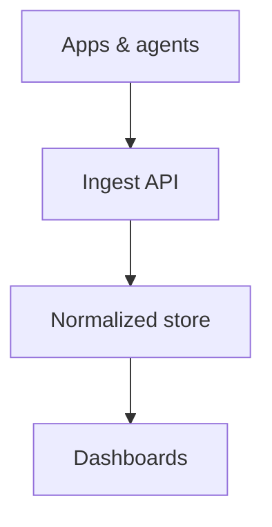

# First-Time Tutorial Protocol

Use this protocol when the learner has not reviewed the code or no trustworthy learner record exists.

## Goal

Build a navigable mental model before presenting implementation details. The first session is successful when the learner can say what the system does, name its major pieces, and choose where to explore next. Code coverage is not the measure of success.

## Zoom ladder

Do not skip a rung:

1. **Purpose:** What problem does this repository solve?
2. **Actors:** Who or what interacts with it?
3. **Containers:** What deployable/runtime pieces exist?
4. **Journeys:** What are the 1-3 most important end-to-end flows?
5. **Topics:** Which concepts make those flows work?
6. **Code:** Which small excerpts implement the selected concept?
7. **Tests:** What behavior or invariant do they prove?

Only advance the main reload path when the learner says `continue`, `next`, or explicitly names a new destination. A question may temporarily zoom deeper to answer it, but preserve the main-path cursor and return to the prior rung afterward.

## Learning-path ordering

Order topics pedagogically:

1. product purpose and vocabulary
2. main happy-path flow
3. data model and boundaries
4. security/privacy/error invariants
5. secondary features
6. operations and deployment

Risk may affect emphasis, but do not begin with the highest-risk subsystem if foundational context is missing.

## Orientation response example

````markdown
This repository runs a service that collects privacy-safe LLM usage events from applications and desktop agents, stores normalized usage data, and turns it into dashboards and recommendations. Its central design problem is accepting useful telemetry without accepting raw prompts, source code, or forged tenant/device identity.



Suggested learning path:
1. The end-to-end event journey
2. Identity and tenant boundaries
3. Privacy-safe metadata
4. Analytics and recommendations
5. Desktop lifecycle

What would you like clarified about this map? Say `continue` when the big picture feels clear.
````

Do not copy this example mechanically. Derive names and relationships from the repository.
Always generate the diagram with the bundled `scripts/kroki_url.py` helper and paste its output
exactly. By default it emits a native ```mermaid fence (shown above); with a local or opt-in public
renderer it returns a Markdown image instead. Never hand-build a direct Kroki `/mermaid/png/...` URL.

## Pacing

- One conceptual diagram per turn is the maximum.
- After `continue`, descend one rung only; do not respond with multiple diagrams or a complete subsystem survey.
- For a journey longer than four stages, use a top-to-bottom diagram or teach it in two segments.
- One code excerpt per turn is the default.
- Keep the learner at the current zoom level while questions remain.
- Offer navigation, not deadlines or estimated minutes.
- Never announce an upcoming quiz during tutoring.

## Evidence discipline

Before making the overview, inspect enough code to validate documentation. Keep the evidence ledger internal unless the learner asks how a claim was established. Say `verified in code`, `documented but not yet verified`, or `inferred` when that distinction matters.
